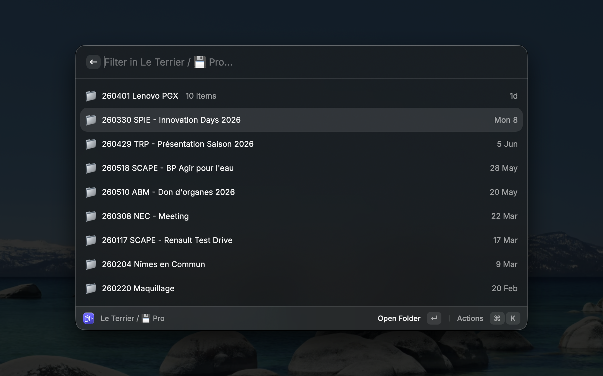
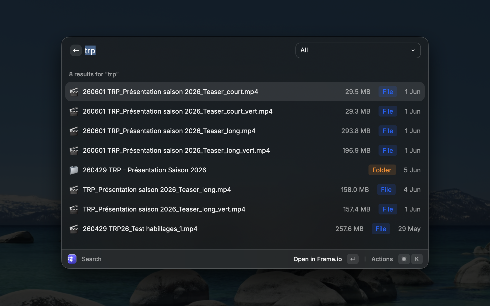
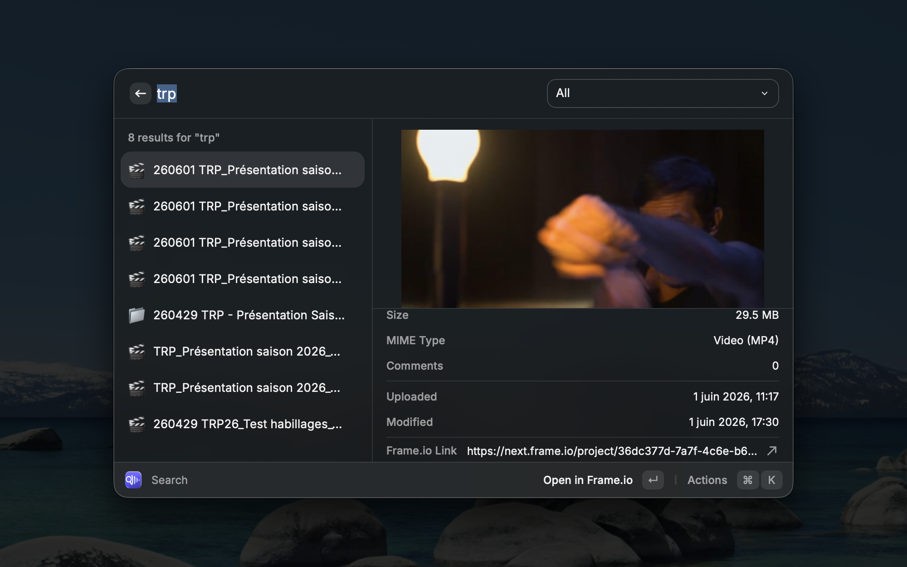

# Frame.io for Raycast

An Raycast extension to browse and search your [Frame.io](https://frame.io) v4 account without leaving your workflow.

***Not** made by frame.io or Adobe !*

## Background

I'm a video editor and Raycast power user. I love how fast it keeps me in my creative flow — but most extensions are developer-focused, and I felt something was missing for production workflows.

I use Frame.io every day to manage deliverables, but jumping to the browser adds friction. So I taken two evening to *∽vibecode∽* this Raycast extension.

The goal is *not* to have a full-featured Frame.io client, but to be able to browse fast your account.

**First-time setup takes about 3 minutes** (one-time Adobe Developer Client ID). A guided onboarding walks you through it on first launch.

## Setup

On first launch (without a Client ID), every command shows a guided onboarding. You can also configure the Client ID in extension preferences (`⌘,`).

1. Go to [Adobe Developer Console](https://developer.adobe.com/console)
2. **Add Project**
3. **Add API** → **Frame.io API**
4. **User Authentication** → **OAuth** → **OAuth Single Page App**
5. Configure:
   - **Default redirect URI**: `https://raycast.com/redirect?packageName=frameio`
   - **Redirect URI pattern**: `https://raycast\.com/redirect.*`
6. Copy the **Client ID** and paste it when prompted (or in extension preferences)

## Commands

### Browse

Hierarchical navigation across your account:

- Workspaces → projects → folders → files
- Sort by name, modified date, upload date, or file size
- Detail view with metadata (size, type, status, comments)
- `Enter` on a folder — drill down
- `Enter` on a file — open in Frame.io in the browser
- `⌘⇧C` — copy the Frame.io URL
- `⌘⇧D` — toggle the detail sidebar
- `⌘⇧I` — copy workspace, project, folder, or file ID
- `⌘[` — back to parent folder (when inside a folder)

### Search

Global search across your entire account:

- Real-time search with debounce
- Filter by type (files, folders, projects)
- Open results in the browser or jump to the parent folder
- `⌘⇧D` — toggle the detail sidebar

### Open Last Folder

Opens the last folder you browsed directly in the extension (not on your account !) — useful when you need to pick up where you left off.

> Pro tip : when working on the same project over and over, assign a hotkey to this command in the Raycast settings !

### Recent Uploads

Lists the latest files uploaded to your workspace (experimental).

### Default browse location

Set a folder to open automatically when you launch **Browse**:

1. In **Browse**, select a workspace, project, or folder
2. Press **`⌘K`** → **Copy Workspace ID**, **Copy Project Folder ID**, or **Copy Folder ID**
3. Open **Extension Preferences** (`⌘,`) and paste the ID into **Browse Default Folder ID**

The next time you launch **Browse**, you land directly in that folder. Use **Browse Workspaces** (`⌘⇧W`) from the action menu to return to the workspace picker at any time. Clear the preference field to reset.

> Because you already are 'up' in the hierarchy, use the back to parent (`⌘[`) option.

## Extension Preferences (`⌘,`)

| Field | Description |
|-------|-------------|
| **Adobe Developer Client ID** | Client ID from Adobe Developer Console (required for first setup) |
| **Browse Default Folder ID** | Optional folder ID — Browse opens here on launch |
| **Sign Out on Next Launch** | Disconnects from Frame.io on next launch (uncheck after signing out) |

## License

MIT — see [LICENSE](LICENSE).

Open source: contributions and issues welcome on [GitHub](https://github.com/phileas/frameio_raycast_extension).
